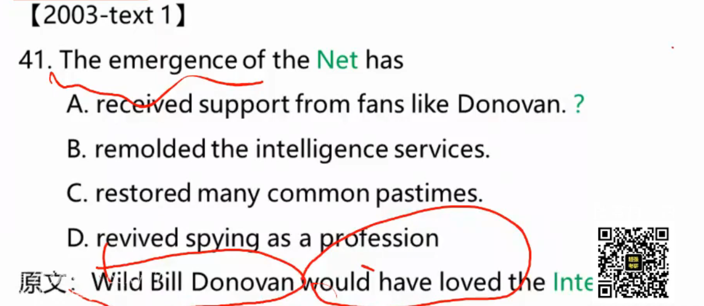
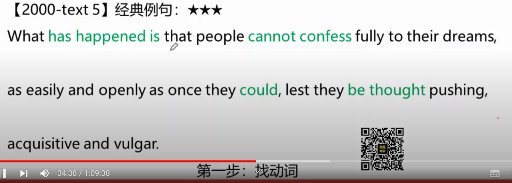
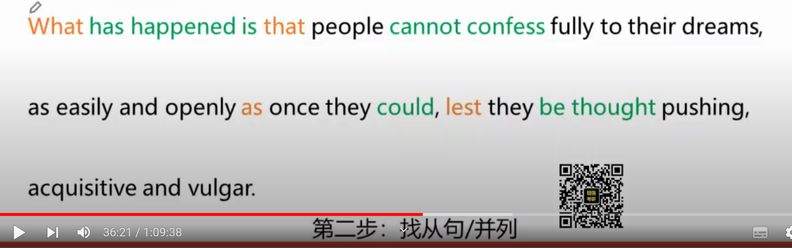
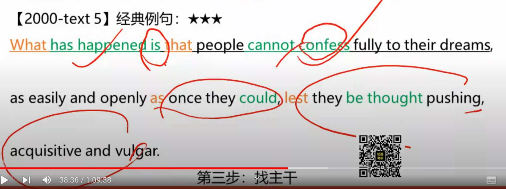
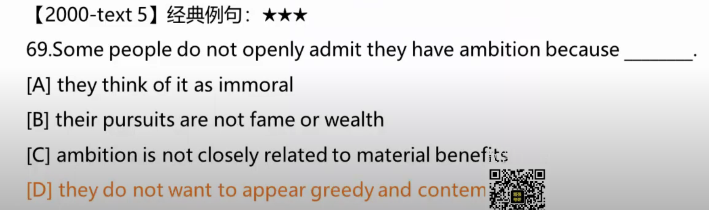
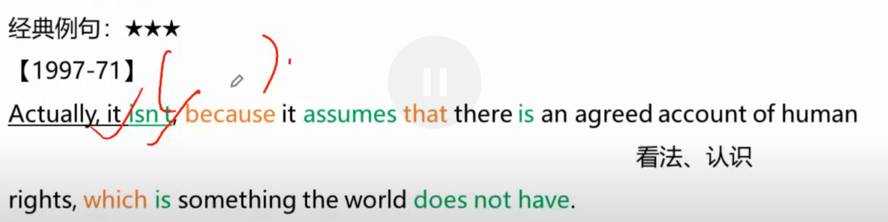
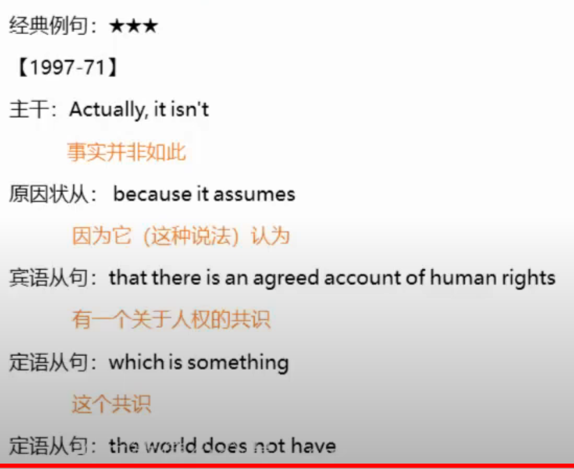
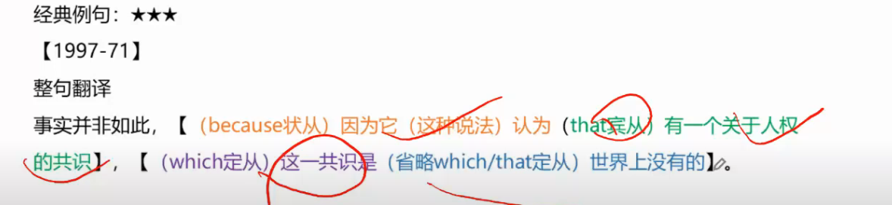

# 考试策略

本文件夹记录应对不同题型的策略

## 6级

### 选词填空

要给单词划分：动词，名词，形容词，副词

每一段的第一句很重要

the __ is 横线填写单数名词

__ of the n. 横线选名词

### 长篇阅读

- 每段句首句尾详细阅读
- 数字人名地名快速定位
- 两个关键词题干原文锁定
- 宾语从句必须向后转移

## 考研

### 选词填空

#### 20-2

- instructive 富有教益的；增长知识的
- inevitable 不可避免的
- harsh 严厉的；苛刻的
- vagus 含糊的；粗略的
- overall 一般来说；总体上
- instead 相反；反而
- otherwise 否则；不然
- however 然而；可是
- defeated 击败；挫折
- confronted (问题,困难等)临到(某人)头上
- confused 使迷惑；使困惑
- surprising 令人吃惊的；出人意料的
- trying 恼人的；难以忍受的
- emerge 浮现；摆脱；暴露
- withdraw (使)撤回；(使)退出
- escape 逃跑；逃避；避开
- 

#### 21-2

- moreover 此外；而且
- emphasize 强调；重视
- identify 确认；找到
- assess 评定；估算
- explain 解释；说明
- nearly 几乎；将近；差点儿
- eagerly 热切地；渴望地
- pinctuality 准时；守时
- hospitality 殷勤好客；款待
- innovation 创新；新思想
- rather 有几分；有点儿；相反；反而
- revenue 收益；收入
- cautious 小心的；谨慎的
- diligent 勤勉的；刻苦的
- purpose 意图；目的；重要意义
- revealed 揭示；透露
- admitted 承认；供认
- departure 起程；班次
- transfer 中转；调动
- moral 寓意；教益
- interpret 诠释；说明；阐释
- sacrifice 牺牲；舍弃
- calling for 呼吁；公开要求
- relating to 涉及；有关
- accounting for 解释；说明
- specify 明确说明；具体指定
- restore 恢复；使复原

#### 22-2

- combined A with B 将A和B结合
- confused A with B 将A和B混淆
- confront A with B 使A(某人)面对B(令人不快或难处的人或场合)
- donate 捐赠；赠送
- generate 产生；生成
- calculate 计算；核算
- condition 情况；条件
- sacrifice 牺牲；舍弃
- put up with 容忍；忍受(虽不情愿，但仍接受)
- make up for 补偿；弥补
- hang on to 紧握；保留；不放弃
- cut down on 消减；减少
- occasional 不经常的；偶尔的
- rapid 快速的；瞬时的
- in charge of 负责；主管
- in addition 除...之外
- indispensable 不可或缺的；必不可少的
- innovative 革新的；创新的
- invisible 看不见的；隐形的
- instant 立即的；方便的；紧急的
- duller 更乏味地
- generously 慷慨地
- at most (数量,程度)至多，不超过(某一数值)
- in turn 依次；相应的；转而
- above all 最重要的是；首先

#### 23-2

- purchase 购买；采购
- predict 预计；预测
- prioritize 优先考虑；给...以优选权
- exclusively 专门地；排他地
- potentially 潜在地；可能地
- despite 尽管；即使
- through 凭借；因为
- besides 除...之外(还)
- inspected 检查；审视
- expanded 扩展；发展
- reformed 改革；改进
- insight 深入了解；深刻见解；洞见
- allocating 分配；把...拨给
- promoting 促进；推销；促销
- at any rate 不管怎样；至少(用于引用更确切地说法)
- by the way 顺带提一下
- in a sense 某种意义上
- serve 对...有用；能满足....的需要
- alter 改变；更改

#### 09

- dimmer 更暗淡的；更愚笨的
- inclination 倾向，意愿
- priority 优先事项
- turns out 证明是；结果是
- puts forward 提出；建议
- spontaneous 自动的
- inevitable 不可避免的
- indefinite 期限不定的；模糊不清的
- perform 做，履行，执行
- in contrast 相比之下
- determine 查明，测定
- above all 最重要的是
- after all 终究；毕竟
- comprehensive 详尽的
- equivalent 相等的
- by accident 偶然
- in time 及时
- so far 迄今为止
- better still 更好的是

#### 08

- obliged 被迫做
- rare 稀罕的，珍贵的
- subsequently 随后，后来
- presently 目前，马上
- previously 以前，先前
- calculating 计算；估计
- disproportionayely 不相称的
- indefinitely 无期限的
- unaccountably 莫名其妙的
- affirm 肯定，证实
- witness 为...的证据
- observe 看到；遵守
- approve 赞成，同意
- given up 留出...给
- got over 使理解
- carried on 继续做；进行
- put down 把(某事)归因于
- valuing 尊重，重视
- supervising 监督，指导
- instrument 工具；重要因素
- subjected 使遭受，经历
- converted 使转变
- paradoxical 似非而是的，自相矛盾的
- incompatible 不能并存的
- inevitable 不可避免的
- continuous 持续的

#### 07

- inhabitants 居民
- presumably 很可能
- incidentally 顺便提一句
- generally 普遍的
- common 共同的
- particular 特指的；特别的
- preached 布道；宣扬（信仰的优点）
- granted 同意
- funded 资助
- interference 干涉，介入
- exclusion 排斥，排除
- influence 影响，作用
- cry 叫喊；口号
- remaining 剩余的，残存的
- produced 引起，带来

#### 05

- committed 致力于；承诺
- dedicated 致力于
- confined 被限制
- anyway 总之
- instead 代替；反而
- even if 虽然，即使
- if only 但愿；但愿
- only if 只有在...的时候
- as if 好像，仿佛
- distinguishing 辨别；看清
- determining 查明，测定
- detecting 察觉
- diluted 使稀释；削弱
- dissolved 溶解
- dispersed 分散
- diffused 扩散；传播
- whereas 而
- stimuli 刺激(物),促进因素
- left 被留交；遗赠
- exposed 接触到
- ineffective 无效果的
- incompetent 不胜任的
- inefficient 效率低的
- insufficient 不充分的
- introduce 推行；引进
- summon 召集；召唤
- create 创造
- repel 推开；使厌恶
- neglect 忽视

#### 04

- centering on 围绕；集中于...
- interaction 互相作用，影响
- assimilation 同化，融入
- consultation 咨询
- discarding 丢弃，抛弃
- resistant 有抵抗力的
- sensitive 敏感的；有感知力的
- in general 通常，一般说来
- by contrast 对比起来
- at length 最后；详细地
- in case 假设，如果，万一
- undertaken 承担，从事
- contrarily 相反地
- consequently 所以，因此
- simultaneously 同时地
- heritage 遗产
- assessable 可估价的
- identifiable 可识别的
- incidence 发生(率)

### 阅读

考研中，虚拟语气是考点，要么不出现，出现就是选择题选项

今昔对比，必为相反

> 考研中有一种套路文章，前面是说以前，下一段就说现在
> 今：now,today,recently,nowdays,现在时
> 昔：ago,before,used to do,过去时

#### 作者态度

考研英语阅读理解部分确实有时会出现询问作者态度或观点的题目。选择正确答案需要考生对文章整体理解深刻，精准把握文章的主旨和作者的意图。当然，有一些选项在特定的情境下很可能是"陷阱"选项，例如你提到的"indifferent"（漠不关心的）。

以下是对这种现象的分析：

1. **文章的目的**：大部分考研英语的阅读材料都是选自于某些学术期刊、报纸或杂志。这些文章的目的一般是为了传递某种信息、观点或者意见。因此，作者通常都对他们写的主题持有某种态度或观点，很少会是完全中立或"漠不关心的"。
2. **教学策略**：为了训练考生的阅读理解能力和分析能力，题目通常会涉及到对文章主题或细节的理解。而一个“漠不关心”的态度通常没有深度，也不能给读者带来什么深入的见解或观点。

基于以上分析，以下是一些可能经常被用作错误选项的词汇：

- **Neutral**（中立的）：与"indifferent"类似，一个完全中立的。虽然有些文章可能表现得中立，但在大多数情况下，作者通常会倾向于某个观点。
- **Uncertain**（不确定的）：除非文章明确表达了作者的不确定感或疑惑，否则这个选项也常常是错误的。
- **Ambivalent**（矛盾的、摇摆不定的）：除非文章明确提到作者对某个观点持有两种截然不同的情感或观点，否则这通常不是正确答案。
- **apathetic**（冷漠的）：与“indifferent”类似，表示对某事不感兴趣或不关心。
- **unconcerned**（不关心的）：也表示一种不关心或不担忧的态度。
- Nonchalant（冷漠的）
- Disinterested（公正的，但有时被误解为不感兴趣的）
- **Ambivalent**（矛盾的、摇摆不定的）：除非文章明确提到作者对某个观点持有两种截然不同的情感或观点，否则这通常不是正确答案。
- **Uninformed**（不了解的、无知的）：文章作者很少会公开承认他们对某个主题一无所知。
- **Apathetic**（冷漠的、无感的）：与"indifferent"相似，很少会是正确答案。
- Objective（客观的）
- Unbiased（无偏见的）
- Disinterested（无私的）
- ambiguous 模棱两可的
- tolerant 容忍的
- cautious 谨慎的

#### 情感词汇

- contempt 蔑视
- admiration 欣赏
- radical 极端的，激进的
- conservative 保守的
- humble 卑微的
- defensive 为之辩护的

#### 策略

通读原文不可取，带着问题看原文，四种句子仔细读，比较句转折句段首段尾否定句。

大家所钟情相信的，必然是作者反对的。

#### 背景

Sheryl Sandberg 和她的书lean in 在考研英语1出现3次，英语2出现2次，出现就是关于性别不平等的话题

#### 虚拟语气

---

#### 文化背景

##### 经济

并购：merge=acquisition=combination=concentration=consolidation

垄断：monopoly

##### 教育
grants 奖学金
loans 贷款
work-study 工读金

###### 金融行业协会

ABA(American Bar Association) 全美律师工会
AALS(Association of American Law School)全美法学院协会
AALL(Association of American Law Library)全美法律图书馆馆员协会

Bar Examination(司法考试)
一年两次 七月与二月的最后一个星期三

### 作文

1. 考研作文以一般现在时为主
2. 中文多主动句型，英文多被动句型
3. 考研写作三层次：词汇——词组——句型，词组比词汇高级，句型比词组高级
4. 每句都用主语开头，文章太单调，可以尝试使用状语作开头。

#### 逻辑关系词

1. 平行关系：equally, likewise, similarly, at the same time, in the meanwhile
2. 转折关系：however, nevertheless, conversely, unexpectedly, on the contrary, by contrast
3. 选择关系：alternatively
4. 递进关系：besides, furthermore, moreover, in addition, subsequently
5. 因果关系：therefore, thus, as a result/consequence, consequently

#### 主语从句

主语从句的高分表达是把主语从句放句末，前面用it做形式主语

#### 凑字数

and = as weel as

众所周知

> - It keeps common knowledge that...
> - It looks beyond dispute that...
> - It is universally acknowledged that...
> - It has been widely accepted that...

It keeps my perspective that...=I think that

#### 委婉语

old man = senior citizens

ugly = plain/homely

fat = big

die = pass by

### 翻译

#### 同位语从句

在翻译同位语从句前加”即“，来告诉阅卷老师你看出来是同位语从句了

#### 定语从句

定语从句是考研翻译中考察最多的句型

Allen's contribution was to take an assumption we all share—that because we are not robots we therefore control our thoughts—and reveal its erroneous nature.
艾伦的贡献是提出了一个我们都认可的假设并揭露其错误的本质，即因为我们不是机器人，因此我们可以控制我们的想法。

定语从句的翻译：

> 前置翻译法
>
> 1. 定语从句结构简单（定语从句长度小于整个从句的三分之一）
> 2. 把定语从句翻译到它所修饰的先行词前，并常常用”的“来衔接
>
> [2003-61] Furthermore, humans have the ability to modify the environment in which they live.
> 此外，人类有能力改变[(in which) 他们居住]的环境
>
> 后置翻译法
>
> 1. 定语从句结构复杂
> 2. 翻译的时候后置，这时常常需要重复先行词或用代词重复

