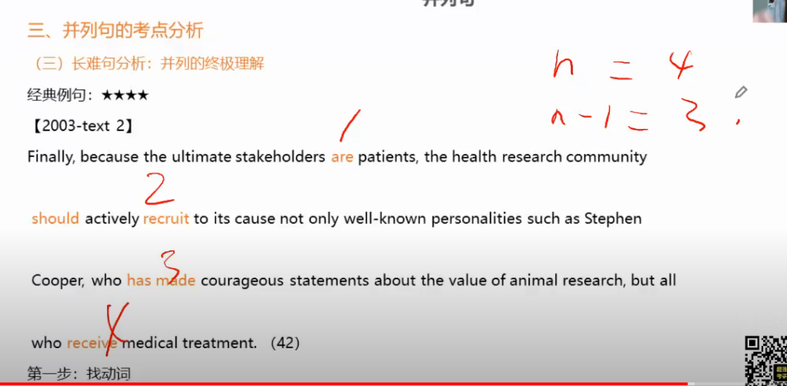
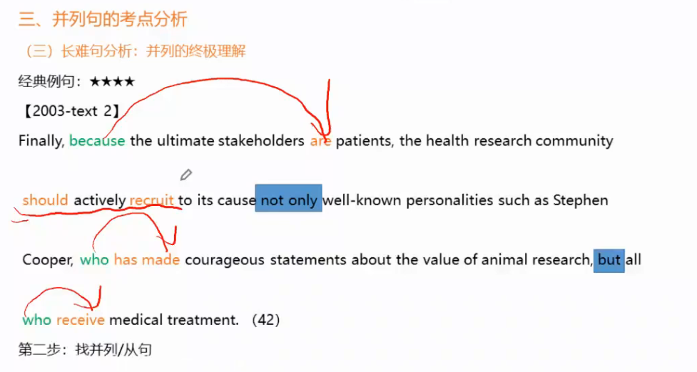
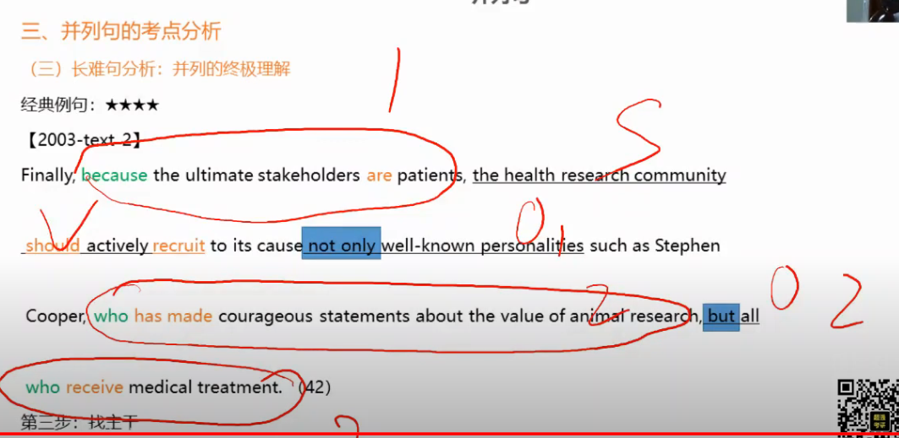
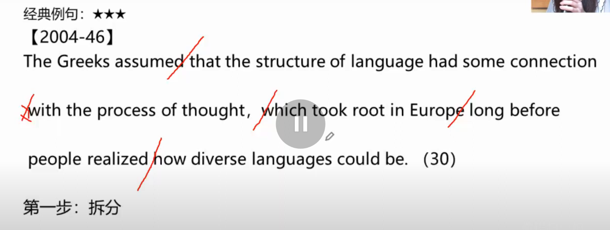
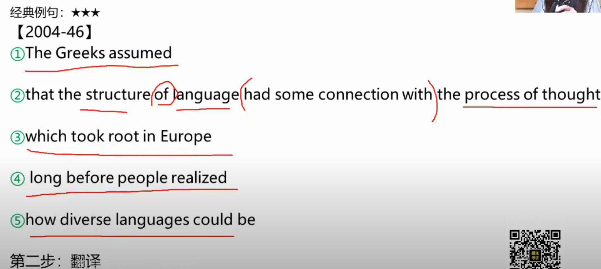
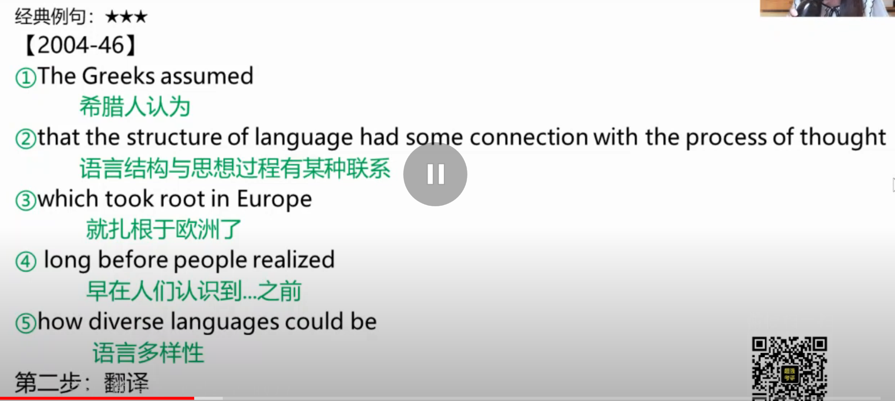
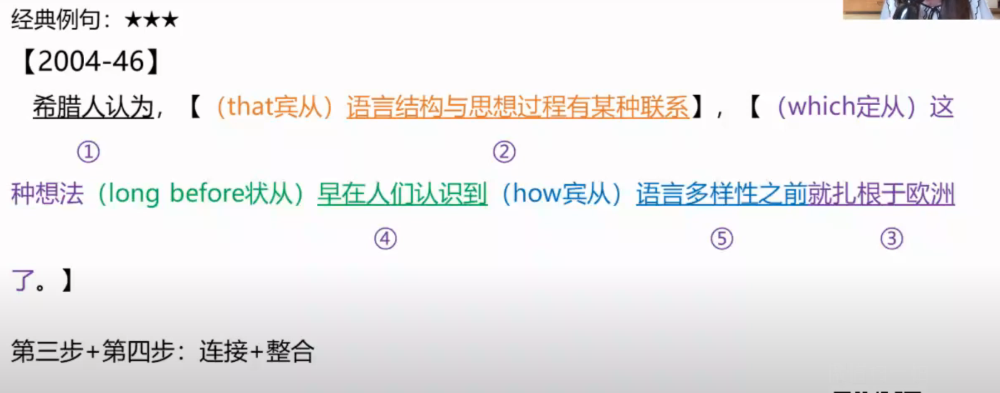
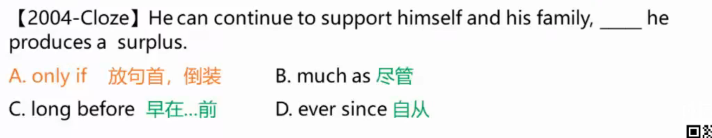

# 英语语法

## 句型

1. 主系表：She is a bride.	主语+系动词+表语
2. SVi: I do.  主语+谓语
3. SVO: I love you.  主语+谓语+宾语
4. S Vt O O : I will give you a kiss.  主语+谓语+双宾语
5. S V O 宾补： I will make you happy. 主语+谓语+宾语+宾语补足语

"主谓双宾"与“主谓宾宾补”的区别：

|        | 主谓双宾                                                     | 主谓宾宾补                                                   |
| ------ | ------------------------------------------------------------ | ------------------------------------------------------------ |
| 含义   | 人+物(sb + sth)                                              | 补充说明宾语的情况                                           |
| 常见词 | give;send;provide;pass;bring;make;show;buy                   | make;call;find;keep;see;let                                  |
| 举例   | (1)Pass me the book,please.(2)She gave me her pen.(3)Mum made us a delicious meal.这里的made是做的含义。 | (1)He made me laugh.这里的made的含义是使...(2)Please call me John.(3)He didin't let me go. |

### 长难句

1. 看逗号找谓语

2. 跳修饰找主干——简化句子原则

   1. 形容词，定语从句

   2. 副词和状语从句

   3. 介词+名词

      The girl by your side is Manchu.

   4. 同位语划掉

      I saw Ly,an expert.

   5. 插入语划掉

      Ly, it is hoped, was a nice person.

3. 后置定语前置翻译


1. 找动词
   
2. 找并列/从句
   
3. 找主干
   

---

长难句分析：能够快速识别各个名词性从句，并通顺翻译出来。

---

长难句处理方法二——拆分法

1. 拆分——断开句子，长句变短
   断句点：连词，引导词，介词，非谓语动词，标点符号
   and, that, in, to do/doing/done, ;
2. 翻译——短句各自翻译
   以每两道竖线之间的小结构为单位，写下汉字。
3. 连接——连接各个短语 构建句内逻辑
   把每两个小节连接为通顺的句子，这时候需要把一些不通顺的词语替换掉，或者适当调整顺序。
4. 整合——语言表达习惯检验
   检查译文是否与中文的表达习惯一致，对原始译文进行调整。










### 从句

从句的种类：

> 按词性：
>
> > 三大类
> >
> > > 名词性从句：主语从句，宾语从句，表语从句，同位语从句
> > > 形容词性从句：定语从句
> > > 副词性从句：状语从句
>
> 按在句中的成分：
>
> > 六种:主语从句，宾语从句，表语从句，同位语从句，定语从句，状语从句


从句的连接词：

> - that
> - which
> - who
> - how
> - when
> - why

从句的识别：

> 1. 看这个从句占据了句子成分的哪个位置(主，宾，表语从句)
>
> 2. 根据引导词，常用的先行词，语义判断(定，状，同位语从句)
>
>    > 1. 引导词：
>    >
>    >    > because;since;as;even though 状语从句
>    >    > that
>    >    > wh-系列：who;whom;whose;which;what;whether;why;when;where;
>    >
>    > 2. 常用的先行词：
>    >
>    >    > fact;view;idea;suggestion;news....
>    >
>    > 3. 语义
>
> 在分析长难句的过程中，能不能分清从句的种类不是重点；
> 能否找到并且把从句分离出来才是重点。
>
> 从句位于句子中间的情况：
>
> > 从引导词开始，到第二个谓语动词结束。

省略引导词的两种情况：

> 1. 定语从句
>
>    > - When the court deals with social policy decisions, the law （that） it shapes is inescapably political...
>    >
>    >   > the lwa is inescapably political...
>    >   > 当法院处理社会决策时，
>    >   > 其所促成的，法律不可避免地具有政治色彩。
>    >
>    > - The way (that) consumers now spproach the process od making purchase decisions means that marketing's impact stems from a broad range of factors beyond conventional paid media.
>    >
>    >   > The way ... means...
>    >   > 这种方式表明...
>    >   > 现在消费者们作出购买决策的方式表明...
>    >   > 营销的影响除了传统的付费媒介之外，还来源于很多种因素。
>    >
>    > - Today the message （that） the average Westerner is surrounded with are not religous but commercial, and forever happy.
>    >
>    >   > Today the message are not religious but commercial, and forever happy ...
>    >   > 如今 围绕着普通西方人的 信息不是宗教信息，而是商业信息并且永远都是欢乐的信息。
>
> 2. 宾语从句
>
>    > - It hoped (that) they would learn how shop-floor lighting affected workers; productivity.
>    >
>    >   > It hoped ...
>    >   > 该委员会希望...
>    >   > 该委员会希望 他们(两位工程师)弄清楚...
>    >   > 该委员会希望 他们(两位工程师)弄清楚车间照明是怎么影响工人的生产效率的。
>
> 原则：
>
> > 先找谓语，再找主语。

分离从句后，如何处理：

> 1. 分离
> 2. 还原

#### 名词性从句

名词能做什么，则有对应的名词性从句。

名词在句子中能充当的成分，全部用从句表达，这就是名词性从句。

名词组成的成分

1. 主语
   e.g. The movie proves marvellous.
2. 宾语
   e.g, I appreciate the actress.
3. 表语
   e.g. She is a teacher.
4. 同位语
   e.g. We found out the fact, the murder.

###### 引导词

名词性从句引导词共分为三类

1. That+陈述句（that不充当任何成分和意思）
2. whether+一般疑问句（1.whether在从句中不充当任何成分，意思翻译成”是否“；2.一般疑问句改成陈述句语序）
3. 所有特殊疑问词（wh-）+特殊疑问句
   p.s. 英语中所有从句一定是陈述句形式，即 引导词+主语+谓语

##### 主语从句

1. 主语是个从句

   从句 + V + O

   That you got 100 was a mystery. 头重脚轻，不好看，进行转换如下

   It was a mystery that you got 100.

- 宾语从句

- 同位语从句

- 表语从句

**that**:在所有的名词性从句前，that都是做连词，后面跟完整的句子(从句)

- Whether smog will continue next week is unclear.

主语从句识别：

> 1. 引导词放句首，并且从句后没有逗号，一定是主语从句。
>    主语从句从句首开始，到主句谓语动词前为止。
> 2. it...that也应当为主语从句，从that开始，到句末结束。
>    it...that也有可能是强调句型，若是把it..that去掉后，剩下的是完整的句子，则是强调句型

##### 宾语从句

S + V + 从句

宾语是个从句

- who which that

  relative noun(关系名词/关系代词)	后加V谓语 +O宾语/S	vt  也可以句子前面完整，这个放后面做宾语

- where when why

  relative conjunction+ S V O 关系连词，后加完整句子(主谓宾),与because,but一样，不过这个连词是与前面的名词直接相关的

例子：

- People think that heavy smog may cause cancer.

---

宾语从句识别：实义动词后面有引导词多为宾语从句（也可能是状语从句）
宾语从句若为that引导，that可以省略。

##### 表语从句

表语是个从句

- One of the causes of smog is that there is much coal emissions in cities.

---

表语从句识别：系动词后面引导词引出的句子为表语从句。

##### 同位语从句

同位语是个从句

同位语是两句话省略的结果；
同位语起解释说明的作用；
同位语本身是名词；
同位语跟在名词后面。

我喜欢电影的结局。
I enjoy the end of the movie.
I enjoy the part of the movie, the end.
同位语不一定紧跟要解释的名词的后面
He got the news from Mary that the sport's meeting was put off.

S, 同位语, + V + O

可以跟同位语从句的名词是抽象名词，通常有news,idea,fact,promise,question,doubt,thought,hope,message,suggestion,words(消息),possibility,decision,view，truth,dream,theory，opinion，assumption(假设)等，一般的"抽象"名词

同位语从句与定语从句的不同：

- 是个名词就可以跟定语从句，但同位语需要抽象名词

- ```
  同位语从句：I knew the information that you got 100.
  定语从句：I knew the information that you got.
  同位语从句中，that做conj，连词，给出information的具体内容
  定语从句中that做relative noun 关系名词，that做主语或宾语，后面跟不完整的句子
  ```

举例：

- The idea that some groups of people may be more intelligent than others is one those hypotheses that dare not speak its names.
  名词/代词+同位语从句 + 谓语 + 宾语 = 一个完整的句子

- To read such books today is to marvel at the fact that their learned contents were once deemed suitable for publication in general-circulation dailies.

- ...however, the conventional view that education should be one of the very highest priorities for promoting rapid economic development in poor countries is wrong.

- The idea that "housing crisis" equals "concreted meadows" is pure lobby talk.

- The weather report that smog will continue for another there days has led many retired people to stop their morning exercises.

- I have no idea whether Gilbert is a great conductor or even good one.我不知道Gilbert是不是一位伟大的指挥，甚至算不算是个好指挥。

- But the idea that the journalist must understand the law more profoundly than an ordinary citizen rests on an understanding of the established conventions and special responsibilities of the news media.

  > Bu the idea ... rests on an understanding of the established conventions and special responsibilities of the news media.
  > 新闻记者应该比普通民众更透彻地了解法律。
  > 这种看法是基于他们对新闻媒体业已确立的规约和特殊责任的理解。

---

同位语从句识别：名词后面跟了引导词引导的句子，且句子内容完整，则为同位语从句。
同位语从句容易和定语从句搞混，两者都在that后出现，从句主干完整是同位语从句，从句主干不完整则是定语从句。

#### 修饰性从句

- 定语从句

  功能相当于adj

- 状语从句

  功能相当于adv

##### 状语从句

###### 副词

1. 副词能充当的成分

   > 状语：
   > She runs away rapidly. 副词修饰动词
   >
   > She looks distinctly rapid. 副词修饰形容词 very good
   >
   > She runs away extremely rapidly. 副词修饰副词 very much
   >
   > Actually,she runs away. 副词修饰句子

2. 什么是状语：
   在一句话中修饰实义动词，形容词，副词，整个句子的成分。
   表状态或程度。

3. 状语的词性

   1. 副词
      She runs away rapidly.
   2. 介词短语
      She runs away,with a smile in her face. 介词做伴随状语
   3. 非谓语动词
      She runs away,opening her mouth. 伴随状语
      She runs away to catch the first bus. 目的状语
      She runs away,heart broken. 原因状语

   介词短语和非谓语动词既能做状语还能做定语。做定语时候要跟着名词，但做状语跟动词和句子

4. 状语的位置：随便放
   She runs away rapidly.
   Rapidly she runs away.
   She runs rapidly away.

5. 状语从句

   1. 状语从句按引导词的意思分类

      | 状语从句种类 | 常见从属连词                                                 |
      | ------------ | ------------------------------------------------------------ |
      | 时间状语从句 | when,**while**,**as**,before,after,**since**,until,as soon as |
      | 地点状语从句 | where                                                        |
      | 原因状语从句 | because,**as**,for,**since**,in that                         |
      | 目的状语从句 | so that,in order that                                        |
      | 结果状语从句 | so ... that,so that, such ... that                           |
      | 条件状语从句 | if,unless, **as**/so long as, once                           |
      | 让步状语从句 | although,though,even though/if,**while**                     |
      | 比较状语从句 | **as**,than                                                  |
      | 方式状语从句 | **as**,as if                                                 |

      三个海王词：

      - as
      - since
      - while
        时间状语：当...时
        让步状语：尽管
        引导并列句：然而

   2. 状语从句中的重点句型
      时间状语从句

      - when系（但...时）：as soon as, as, the moment 那一时刻, the minute 那一分钟, the second 那一秒, instantly 立刻, immediately...
        ____ the baby saw his father,he starts crying.上面这些都可以填入
        the moment/mimute/second + 句子：当...时候 这时就是从属连词
        instantly/immediately+句子：当...时 这时也是从属连词
      - 一...就...：No sooner...than;Hardly...when;scarcely...when
        He had no sooner taken the medicine than he died.
      - 一旦...:once. as soon as
        Once you understand it, you will have no further difficulty.
        As soon as you understand it, you will have no further difficulty.

      条件状语从句
      if系：suppose (that), supposing (that), provided (that), providing (that), assuming (that), if only, only if ... 如果
      

      目的状语从句

      - “为了”系：in order that + 从句； so that + 从句（如果，so和that分开，so...that..如此...以至于，that引导是结果状语从句）
      - "为了不"系：in case + 从句：(should) + v.
        lest + 从句：（shoule）+ v. 唯恐；以免
        e.g. In case I (should) get ill in the future, I bought the huge insurance.
        注意用到了虚拟语气

      比较状语从句
      多-肯定  少-否定
      A more than B; = more A than B = A比B多 A肯B否
      与其（说）B，不如（说）A
      A less than B; = less A than B = A比B少 A否B肯
      与其A,不如B
      A as much as B; = as much A as B = AB一样多 AB肯
      不仅A，而且B；既A，又B；亦A亦B
      A not so much as B; = not so much A as B = A少B多 A对
      与其（说）A，不如（说）B

      

---

```
状从省略三要求，
从句引导特殊词，
从句主句共主语，
从句且为主系表，
主系同进又同出，
留下表语引导词。
when he was young, LY read aloud.
省略：when young,Ly read aloud.
```

7个引导词：though/although/even thought/when/while/if/as

even though 一般引导让步状语从句

until 时间状语从句的标志

so that 结果状语从句

- Beijing is planning to install air purifiers in schools as the city chokes on heavy smog. 原因状语从句

##### 定语从句

修饰名词或代词的成分叫定语。

一般翻译成 ...的+名词

定语的词性

> 1. adj
>    The little Prince
> 2. n
>    the rose of the little price 小王子的玫瑰花
>    pay gap 收入差距
> 3. 介词短语
>    a little prince in green 绿衣服的小王子
>    the rose out of the window 窗外的玫瑰
>    介词短语就因为长度会永远放在名词后面
> 4. 非谓语动词
>    His efforts to carry out the task is admirable.
>    The fly flying to Beijing is admirable.
>    The flying fly is admirable.
>    The broken heart hurts.
> 5. 形容词性物主代词
>    my book
>    your sister

---

1. 构成
   n(先行词) + 引导词 + 句子

2. 引导词

   - 按先行词种类分五类

     1. 先行词为人，引导词who/whom/whose/that
     2. 先行词为物，引导词that/which/whose
     3. 先行词为时间词，引导词为that/which/when
     4. 先行词为地点词，引导词为that/which/where
     5. 先行词为reason，引导词为that/which/why

     由whose,when,where,why引导的定语从句，从句主干完整

   - 按引导词本身词性分类
     1. 关系代词：who/whom/that/which在从句中一定要充当主语或宾语
     2. 关系副词：when/where/why在从句中不充当成分
     3. 形容词：whose在从句中修饰最近的名词
        Sheryl Sandberg is a writer whose books are popular.
        The book whose author is Sheryl Sandberg is popular.
        whose可以跟人也可以跟物

3. 定语从句特殊用法

   >1. 如果先行词和引导词间有介词，先行词为人，只可用whom(不用who)
   >   先行词为物，只可用which(不用that)
   >   I will never forget the day on which I met you.
   >   He is the man who/whom/that we should learn from.
   >   定语从句引导词前有介词，该介词来自于
   >   1. 从句中的动词词组
   >   2. 与先行词的搭配
   >2. 区分限制性和非限制性定语从句
   >   The boys who knew about the floods took another road. 限制性定语从句
   >   The boys, who knew about the floods, took another road. 非限制定语从句
   >   非限制定语从句的先行词
   >   1. 是它前面最近的名词或代词
   >   2. 是它前面整个句子
   >3. that引导定语从句，若that在从句中充当宾语，that可以省略。
   >   分析长难句时，两个名词或代词或一个名词和一个代词在一起，中间没有被连词或标点隔开，通常都是省略了that的定语从句。
   >   I collected some books you don't have.
   >   I just met a lady I saw last week.
   >4. the same...as  the same..that
   >   He is the same man that I love. 是
   >   He is the same man as I love. 像/正如
   >   作为定语从句as引导的一定不完整，如果完整就是状语从句，可以限制性定语从句，也可以是非限制性定语从句

4. 定语从句V.S.同位语从句
   n.+that从句

   > - that引导同位语从句：三不原则
   >   that不当成分，不具含义，不可省略
   > - that引导定语从句：三有原则
   >   有成分，有含义，有时可省略（that在从句做宾语）

定语的位置

> 短前长后：一个词放名词/代词前；多个词放名词/代词后（后置定语）
> 例外：形容词修饰不定代词（something/anything/nothing）时，放其后
> something special

定语从句做后置定语：

> 名词/代词+连接词+从句 + 谓语 + 宾语 = 一个完整句子
>
> The movie Zootopia that won serversl awards is interesting.
>
> Socila scientists who complain about a lack of funding should not expect more in today's economic climate.

```
定语从句分两种，	非限制性定语从句与非限制性定语从句
限与非限看逗号，
物用which人用what,	(人物混用：人 and 物 用that)
不定代词用that,	anything这样的只能用that
定从少定用whose,	定语从句少定语时候用whose,whose连接人，物都可以，package whose cobver lstter is red.
the place where/reason why
时间要用time when
```

定从省略:

英语中一共两个省略，一个是宾语从句that省略，一个就是定语从句that省略

```
定从省略分两种。	
关系代词做宾语，
从句可无关系词。	The book that i wrote is about TOEFL. The book 是在wrote后面做宾语，因此that 可以省略：The book i wrote is about TOEFL.
关系代词做主语，
从句且为主系表，
主系同进又同出，
留下表语做定语。	The book that was written.可以省略为:The book written.
```

- Smog is a kind of air pollution that is very harmful to human health.

- Law is a discipline which encourages responsible judgment.法律是一门鼓励负责任的判断的学科。

- ..., using a fashion model that does not meet a government-defined index of body mass could result in a $85,000 fine and six months in prison.

  > ..., using a fashion model ... could result in a $85,000 fine and six months in prison.
  > 雇佣时尚模特会导致85000美元的罚款以及六个月的监禁。
  >
  > 雇佣未达到政府规定的身体质量指数的时尚模特会导致85000美元的罚款以及六个月的监禁。

- The people who've been hurt the worst are those who've stayed too long.

  > The people ... are those ...
  > 受害最深的  是那些  待的太久的人。、

###### 非限制性定语从句

，+which

- 

多种混合的情况：

> - Almost everyone who was interviewed for this special report said that biggest problem at the moment is not a lack of demand but a lack of good work to sell.
>
>   > Almost everyone ...said...
>   > 几乎所有的人都说...
>   > 几乎所有的 接受这次特别报道采访的（定语从句） 人都说 目前最大的问题不是没有需求量，而是没有好的作品以待销售（宾语从句）
>
> - Do you remember the days when scientists argued that smoking would kill us but the doubters insisted that we didn't know for sure?
>
>   > Do you remember the days ... ?
>   > 还记得那些年吗？ 科学家提出 吸烟会使我们丧命，而怀疑者们却坚称我们不能下此定论。
>   > 时间状语从句包含(宾语从句 but 宾语从句)
>
> - It would be a shame to raise prices too much because it would drive away the young people who are Stratford's most attractive clientele.
>
>   > It would be a shame to raise prices too much.
>   > 大幅提价将会是一件令人蒙羞的事。
>   > 因为这样做会把那些 ”sStratford镇最有吸引力的“ 年轻人赶走。
>
> - In the idealized version of how science is done, facts about the world are waiting to be observed and collected by objective researchers who use the scientific method to carry out their work.
>
>   > facts about the world are waiting to be observed and collected by objective researchers.
>   > 在理想化的科学研究中，
>   > 有关这个世界的真相等待着 运用科学方法开展研究 客观的研究者们去观察和收集。
>
> - How do archaeologists know where to find what they are looking for when there is nothing visible on the surface of the ground?
>
>   > How do archaeologists know
>   > 当地表没有任何痕迹的时候， 考古学家怎么知道 要到哪里去寻找 他们想要的东西呢？
>
> - He help popularize the idea that some diseases not presently thought to have a bacterial cause were actually infections, which aroused much controversy when it was first suggested.
>
>   > He help popularize the idea...
>   > 他曾推动普及这样一种观点：
>   > 一些以前被认为不是由细菌引起的疾病实际上也是传染病。
>   > 这种观点被首次提出时，曾引起极大争议。
>
> - The decision of the New York Philharmonic to hire Alan Gilbert as its music director has been the talk of the classical-music world ever since the sudden announcement of his appointment in 2009.
>
>   > The decision of the New York Philharmonic to hire Alan Gilbert as its music director has been the talk of the classical-music world.
>   > 纽约爱乐乐团将于2009年聘任Alan Gilbert作为下任音乐总监，这个决定自突然宣布以来，就一直是古典音乐界谈论的话题。
>
> - He argued that humna evolution was charactorized by a struggle he called the "survival of fittest", in which weaker races and societics must eventually be replaced by stronger, more advanced races and societies.
>
>   > He argued...
>   > 他认为，人类进化的特点是他称之为”适者生存“的斗争。在这场斗争中，弱小的种族和社会终将被更强大，更先进的种族和社会所取代。
>
> - Creating a "European identity" that respects the different cultures and traditions which go to make up the connecting fabric of the Old Continent is no easy task and demands a strategic choice——that od producing programs in Europe for Europe.
>
>   > Creating a "European identity" is no easy task and demands a strategic choice.
>   > 不同的文化和传统把欧洲大陆编制成一体，
>   > 要创造出 一种尊重这些不同文化和传统的 ”欧洲品牌“并非易事，需要人们做出战略性的选择——也就是选择在欧洲为欧洲制作节目。
>
> - McGee says leaving without a position lined up gave him time to reflect on what kind of company he wanted to run.
>
>   > MeGee says ...
>   > 麦基说，没有安排好（新）职位就辞职给力他时间认真思考想要管理什么类型的公司。
>
> - So, what Kennedy was referring to was that while GDP has been the most common method for measuring the economic activity of nations, as a measure, it is no longer enough,
>
>   > So, what Kennedy was referring to was...
>   > ...it is no longer enough.
>   > 因此，肯尼迪所说的这句话意思是，尽管GDP一直以来是衡量一个国家经济活动最常用的测量方法，它现在已经远远不够了。
>
> - But policy makers who refocus efforts on improving well being rather than simply worrying about GDP figures could avoid the forecasted doom and may even see progress.
>
>   > But policymakers ... could avoid the forecasted doom and may even see progress.
>   > 那些将注意力集中于改善民生而不仅仅是担忧GDP数值的 决策者不仅可以避免预期的悲观经济前景，甚至有可能有所进步。
>
> - Calls to disassemble all telescopes on Mauna Kea or to ban future development there ignore the reality that astronomy and Hawaiian culture both seek to answer big questions about who we are, whre we come form and where we are going.
>
>   > <font color='yellow'>Calls to disassemble all telescopes on Mauna Kea or to ban future development there</font> ignore the reality...
>   > <font color='yellow'>(有的人)要求拆除位于Mauna Kea火山的望远镜或者禁止当地天文事业的发展，</font>这（种做法）忽视了这样一个事实：<font color='red'>天文和夏威夷文化意义，都试图寻找这些重大问题的答案——我们是谁？我们从哪来？要到哪去？</font>
>
> - His anslysis should therefore end any self-contentedness among those who may believe that the global position of English is so stable that the young generation of the United Kingdom do not need additional language capabilities.
>
>   > His analysis should therefore end any self-contentedness ...
>   > 因此，他的分析会终止一些人的自我满足——这些人可能认为英语的世界地位非常稳固，因此英国年轻的一代不需要额外的语言能力。
>
> - But it's interesting to wonder if the images we see every week of stress-free, happiness-enhancing parenthood aren't in some small, subconscious way contributing to our own dissatisfactions with the actual experience, in the same way that a small part of us hopod getting "the Rachel" might make us look just a little bit like Jennifer Aniston.
>
>   > But it's interesting to wonder ...
>   > the images ... aren't ... contributing to our own dissatisfactions with the actual experience,
>   > a small part of us haped ...

#### as

- 定语从句（正如）不完整句子

- 状语从句

  > - 时间状从“随着...”","一边...一边..."
  > - 原因状从“因为，由于”=seeing that
  > - 方式状从“正如”完整句子
  > - 让步状从“”尽管
  > - 比较状从
  >   - as much as
  >   - not so much ... as

- 常见搭配

  > - as well 也
  > - as a whole 作为一个整体
  > - as yet 迄今

### 平行结构

见到平行看结构，形式功能要对称

1. 形式对称

   I have not only studied GMAT but also enjoyed my life.

   确定题型通过：平行连接词

   连词的记忆提示：**Fanboyer**

   >- F-form A to B
   >
   >- A-and/as well as
   >
   >- N-not only ... but (also)/neither nor/not but(rather)
   >
   >- B-but/both A and B
   >
   >  > skeptical but enlightened 具有怀疑精神且开明的，不能用and,因为前面是否定态度，后面是肯定态度，一方面否定一切，一方面又接受一切
   >
   >- O-or
   >- Y-yet
   >- E-either ... or
   >- R-rather than
   >
   
2. 功能相同

   1. 过去分词与现在分词并列

      >born and growing 被生然后主动长大
      >
      >filigree spawned by spores and extending 由孢子产生并延伸的花丝

   2. what 从句与名词的并列

      > Beijing and what is now Guangzhou

   3. 含义单一

      > S V that S1 V1 O1 and S2 V2 O2 这个是错的
      >
      > > 后面的S2 V2 O2这个句子，and前面平行一个句子，可是前面的句子既可以认为是S1 V1 O1 ,也可以认为是S V that S1 V1 O1这个句子
      >
      > S V that S1 V1 O1 and **that** S2 V2 O2
      >
      > > 两个从句并列，并列连词


### 并列句

#### 基本特征

##### 定义

由并列连词把两个或以上简单句连在一起的句子
e.g. You are a smart girl but don't work hard.

##### 识别

简单句+并列连词+简单句
e.g. Hurry up or you'll be late.

#### 并列连词

并列句的连接词：

> - and
> - but
> - or
> - nor

1. 平行关系：and, not only...but also, both...and  equally, likewise, similarly, at the same time, in the meanwhile
2. 转折关系：but, yet, while, whereas  however, nevertheless, conversely, unexpectedly, on the contrary, by contrast
3. 选择关系：or  alternatively
4. 递进关系：then  besides, furthermore, moreover, in addition, subsequently
5. 因果关系：for, so  therefore, thus, as a result/consequence, consequently

#### 表现形式

##### 常规形式

完整简单句+并列连词+完整简单句

##### 特殊形式

- 完成简单句；完整简单句

- 省略

  > - He will work hard and (he will) pass the exam.
  > - (You) Hurry up or you'll be late.

### 否定句

I have never been to Australia. 这个不是否定句，是表示否定的肯定句

I am senior to you.这个是比较句，但不是比较级

I am older than you.这个是比较级

否定句需要not或no

1. not/no 不能用and，用or
2. not/no so ... as 好于 not/no as ... as

### 后置定语

1. adj短语

   - a book useful

2. 介词短语

   - a book on the desk
   - Movies about love enjoy much popularity among youngster.
   - Retail sales of food and drink in Europe's largest markets are at a standstill ...
   - Since the days of Aristotle, a search for universal principles has characterized the scientific enterprise.

3. 形容词短语
   考研英语中比较少见

4. 分词后置

   - 现在分词
     - a bird living in a nest
     - The magazine cover showing an attractive mother holding a cute baby is hardly the only Madonna-and-child image on newsstands this week.

   - 过去分词：
     - the beach polluted by oil.
     - The movie named Zootopia is interesting.
   - 过去分词：
     - The first thing needed for innovation is a fascination with wonder...

   **非谓语**:to do doing done 找到其发出者可承受者.

5. 不定式

   - a way to solve the problem
   - The movie to be released in 2018 has gained much attention.
   - The decision to quit a senior position to look for a better one is unconventional.

   to do 在句首会打逗号，但没有在句尾打逗号再to do的，句尾就不断开的

5. 表语形容词

   - a cat alive
   - twins alike

   **不定代词只能用后置定语**

   - anything now
   - someting right
   
5. 定语从句

8. 同位语从句

   > The news that the movie has won Oscar surprised us.

### 伴随功能结果

- SVO,doing

  > Ly always changes his mind, making me angry.

- SVO, thus doing.

- SVO,there by doiing.

### 谓语与非谓语

为什么要先找谓语：

> 1. 任何一个独立的句子，有且只有一个主谓结构。
> 2. 谓语动词是句子的核心，表明主语的状态/动作。
> 3. 谓语较短，好找，变化比较固定（三态+否定）
> 4. 主语有多种变化形式，且经常较长，不易辨认

长难句的谓语：

> - 无论是简单句还是长难句，都是有且只有一套主谓结构。
> - 当一个长句子是由并列的几个句子连接而成的，则会有几套主谓结构。
> - 当句子中有从句时，从句的内部也会有谓语动词。

#### 动词

- 及物动词

  > 团结协作

- 不及物动词

  > 自力更生

#### 谓语动词的种类

- 实义动词
  eat;have;love;make;
  具有实在的意思
  及物动词（vt.） 不及物动词（vi.）
  及物动词：必须加宾语
  不及物动词：加介词才能加宾语，可以不加宾语
  大多数动词及物不及物兼具
  Class begins
  Let's begin our class
  
- 情态动词
  can;could;may;might;must;shall;should
  表示情绪，态度，推测
  1. 表达说话人主观态度的词
  
  | 词义       | 情态动词               | 情态动词词组                                                 |
  | ---------- | ---------------------- | ------------------------------------------------------------ |
  | 能够       | can,could              | be able to, be capable of                                    |
  | 可能       | may,might,can,could    | be likely to, be possible to                                 |
  | 意愿，打算 | will,would,be going to | be willing to, wish to do                                    |
  | 应该       | shall,should,must,need | be suggested to, be advised to, be supposed to, be required to |
  
  2. 对过去的推测
     must have done 过去一定做过某事
     couldn't have done 过去一定没做到某事
     needn't have done 本没必要做某事，但做了
     could have done 本能够做某事，但没做（表遗憾）
     should have been 本应该做某事，但没做（没遗憾）
  
- 助动词
  do;will;shall;have
  陈述句变疑问句；强调语气
  在一句话中帮助谓语构成时态，语态，否定，疑问的词
  I **am** having an English class.
  I **am going to** be a lawyer.
  I **am** beated.
  I **don't** love you.
  
- 系动词
  六类:
  
  - be动词
    am;is;are
  - 感官类
    smell;taste;feel;sound
  - 变化类
    become;get;grow;fall;turn;go;come
  - 表像类
    look;appear;seem
  - 状态类
    stay;keep;remain
  - 终止类
    prove;turn;out

#### 谓语动词的变化

- 时态
- 情态
- 语态
- 否定

三态加一否

##### 时态

| 时间         | 状态         |
| ------------ | ------------ |
| 现在时间     | 一般状态     |
| 过去时间     | 进行状态     |
| 将来时间     | 完成状态     |
| 过去将来时间 | 完成进行状态 |

时间+状态：16种时态

考研英语中常见的时态:

> - 一般现在时
> - 一般过去时
> - 一般将来时
> - 现在进行时
> - 现在完成时
> - 过去完成时

|          | 过去           | 现在               | 将来                           | 过去将来                       |
| -------- | -------------- | ------------------ | ------------------------------ | ------------------------------ |
| 一般     | did(was/were)  | do/dose(am/is/are) | will do(am/is/are going to do) | would do(was/were going to do) |
| 进行     | was/were doing | am/is/are + doing  |                                |                                |
| 完成     | had + done     | have/has + done    |                                |                                |
| 完成进行 |                |                    |                                |                                |


| 中文                             | 英文                 |
| -------------------------------- | -------------------- |
| 他（过去）被打了。               | He was beaten.       |
| 他（现在）被打了。               | He is beaten.        |
| 他将会（现在的将来）被打。       | He will be beaten.   |
| 他将会（过去的将来）被打。       | He would be beaten.  |
| 他过去正在被打。                 | He was being beaten. |
| 他现在正在被打。                 | He is being beaten.  |
| 他过去已经（过去的之前）被打了。 | He had been beaten.  |
| 他现在已经（现在的之前）被打了。 | He has been beaten.  |


##### 情态

含义：

> - 表示情绪和态度
> - 表示推测

构成：情态动词+动词原形

| 现在时 | 过去时/委婉 | 含义       |
| ------ | ----------- | ---------- |
| can    | could       | 能够，可以 |
| may    | might       | 可以，可能 |
| will   | would       | 愿意/将要  |
| shall  | should      | 应该       |
| must   |             | 必须，一定 |

##### 语态

主动语态：主语做出的动作，是动作的执行者

被动语态

> 主语是动作的承受者。英语喜欢使用被动语态。
>
> 被动语态的构成：be动词+动词的过去分词

##### 否定

| 动词种类 | 否定形式            |
| -------- | ------------------- |
| 实义动词 | 助动词+not+动词原形 |
| 情态动词 | +not                |
| 助动词   | +not                |
| 系动词   | +not                |


#### 非谓语

> 句子有主谓宾定状补，非谓语就是不能做谓语的成分
>
> 做主语宾语就是动名词，做定状补就是分词

```
谓与非谓经常混
谓语句中就一个
其余动词非谓语
非谓形式有三种
ing/ed和to do
现在分词表主动
过去分词表被动
目的要用不定式
主宾要用动名词
```

- 分词做状语

  >1. 分词，SVO
  >
  >2. S V, 分词
  >
  >   >I came in, singing,
  >   >
  >   >I came in, followed by a dog.

- 分词做定语

  >The bird living in a nest, is named LY.
  >
  >The beach polluted by oil, belongs to Japan.

- 分词做补语

  > LY saw the donkeys tied to a tree.
  >
  > LY kept the boy crying.

结论：分词有名词，名词决定主被动。分词无名词，主语决定主被动。

### 主语

含义：

> 句子的主题/对象:
>
> - 某个人/一些人
> - 某个物/一些物
> - 某件事/一些事

位置：一般情况下，在谓语的前面（倒装句除外）

哪些成分可以做句子的主语：

> 1. 名词或代词
>
>    > 具有实际意义的名词：a book;an apple;scientists;animals
>    > 抽象性名词：fact;idea;analyses;solution;prospect前景;
>    > 代词：I;you;he/she;
>    >
>    > 名词作主语时，经常有后置定语来修饰限定这个名词。
>    > 或者，会有一个同位语从句来对主语进行补充说明。
>    > 因此，名词部分会变长，与谓语的距离会变远。
>
> 2. 动词短语
>
>    > 1. 动名词 doing
>    >
>    >    > 表示经常性，习惯性的动作(抽象)
>    >    >
>    >    > - Losing a job is hurting...
>    >    > - Playing video games encourages immediate content.
>    >    > - 
>    >
>    > 2. 动词不定式 to do
>    >
>    >    > 表示具体的动作(it作形式主语，来避免头重脚轻)
>    >    >
>    >    > to do ...is...
>    >    > It is ..to do...
>    >    >
>    >    > - It is wise to take such gifts with gratitude and grace.
>    >    > - It's the hardest thing to take care of a teenager...
>    >    > - It is painful to read these roundabout accounts today.
>    >    > - To read such books today is to marvel at the fact that their learned contents were once deemed suitable for publication in general-circulation dailies.
>
> 3. 句子(主语从句)
>
>    > 1. 主语部分不是单个的词，而是一个句子
>    > 2. 引导词
>    >    that;whether;what;who;which;why;how;when;
>    >
>    > 为了避免头重脚轻，经常用it作形式主语，it放在最前面，从句放在后面。
>    >
>    > - Exactly when that day will be is a matter of debate.
>    >
>    > - What makse this slump different from the last, he says, is that there are still buyers in market.
>    >
>    > - It is not ye clear how advertisers will respond.
>    >
>    > - ... it is surely a good thing that the money and attention come to science rather than go elsewhere.
>    >
>    > - ...whether the community's work contributes much to an overall accumulation of knowledge is doubltful.
>    >
>    > - However, whether such a sense of fairness evolved independently in capuchins and humans, or whether it stems from the common ancestor that the species had 35 million years ago, is, as yet, an unanswered question.
>    >
>    >   > whether...or whether... is an unanswered question.
>    >   > 究竟是...还是....，至今仍然是未解答的问题。
>    >   > 主语1：whether such a sense of fairness evolved independently in capuchins and humans.
>    >   > 主语2：or whether it stems from the common ancestor that the species had 35 million years ago.
>    >
>    > - As you will come to see, knowing that mental health is always available and knowing to trust is allow us to slow down to the moment and live life happily.
>    >
>    >   > knowing ...and knowing ... allow us to slow down to the moment and live life happily.
>    >   > 知道...知道...，我们就可以放慢生活节奏，快乐生活。
>    >   > 主语1：knowing that mental health is always available.知道心理健康总是存在
>    >   > 主语2：knowing to trust it.我们可以信任它


### 独立主格

SVO,独立主格(独立结构)

SVO, with/without 独立主格

```
SOV, A + B
SOV, with A + B
A:代词，名词
B:adj,adv,介词短语，分词，不定式
```


```
独立主格要认清，
名代之后形或副，	A的两种形式
不定分词和介短，	B的5中形式
with结构不可轻，
名代二问是其主，	名词和代词是其主要描述对象
千变万化做状语。	整个做状语
```

I  came in, a book in my hand.

### 不定代词

```
any		body
no		thing
every	one
some
左边四个与右边四个两两组合就是不定代词
```

### 强调句型

It is + 被强调部分A + that B

将被强调的部分放在前面，其他部分置于that之后，被强调部分可以是主语，宾语，表语或状语，不能是谓语，谓语用do:I do love you。强调的主语如果是人，that可以由who换用。如果把这种句型结构划掉后，A+B则是个完整句

It is that 强调句型

It is A that/who B

A + B为完整句子

```
You got 80 in 2014.
It was you who got 80 in 2014.
It was 80 that you got in 2014.
It was in 2014 that you got in 2014.
You did get 80 in 2014.
```

### 不定式

```
to加动原不定式，
非谓不做谓语用，
功能如同名形副，
疑问副代可连用，	I wonder how to solve the problem.
宾补有to分两种,	see sb do.	cause sb to do.
前面加not是否定,	cause sb not to do.
```

疑问代词：what/who/which + to do(Vt及物).	what/who/which 在do后面做宾语

疑问副词：whether/when/where/how + to do(Vi不及物) + O. whether/when/where/how只是做副词，不是宾语，后面要再加宾语。

I don't know who to invite.

I don't know how to invite her.

what和which的区别:

> 不知道具体什么东西时用what
>
> 前面有个范围可供选择用which，无范围用what

不定式的省略

> 一个感觉 feel like
>
> 两个听 hear/listen to	hear sb do sth
>
> 三个让 make/have/let	let you go
>
> 四个看 see/look/observe/watch	see sb do 看见全过程 see sb doing 看见正在做
>
> help 半个help两均可，被动以后to还原	help sb do;help sb to do;help do;help to do;这四个都对。be seen to do,改成被动后不能省略to
>
> 使役	make sb do;make sb doing;make sth done;be made to do

to与do不共存的省略：

> - do but(but后省略to)
>
>   I have no choice but to call the police.
>
>   I have nothing to do but call the police.
>
> - 主语中出现do/did/does,表语的to要省略
>
>   What i want to do is go shopping.

### 倒装

```
倒装结构两大类，
部分全倒主看谓。
句首强调there be。	There are books.	Books are there.
部分倒装分四种，
only加状语/状从在句首，
否定副词/连词提句首，
so that结构so提前，
承前否定neither/so。
```

Only at night does he feel panic.	部分倒装

Ahead of us is the Great wall. 全倒装，强调前面。

- 全部倒装

  > 全部倒装是只将句子中的谓语动词全部置于主语之前。此结构通常只用于一般现在时和一般过去时。常见的结构有：表+系+主

- 部分倒装

  > 原则：
  >
  > 1. 主倒从不到
  > 2. 双重否定不到装
  >
  > ---
  >
  > 1. only + 状语/状语从句 部分倒装
  >
  >    > Only at work does he fell happy.
  >    >
  >    > Only when you get 900 will you feel better.
  >    >
  >    > Only you can go with me to the west heaven. 这句没有倒装
  >
  > 2. 句首为否定或半否定的词语，如no,not,never,seldom,litte,hardly,at no time,in no way,not until...等。例如：
  >
  >    > Never have i seen such a performance.从未见过如此糟糕的表演。
  >    >
  >    > Nowhere will you find the answer to this question.无论如何你不会找的这个问题的答案的。
  >    >
  >    > Not until the game had begun did i arrive.	部分倒装
  >    >
  >    > Not untill the child fell asleep did the mother leave the room.母亲一直到孩子入睡后离开房间。
  >
  >    注意：如否定词不在句首不到装。例如：
  >
  >    > I have never seen sucj a performance.
  >    >
  >    > The mother didn't leave the room until the child fell asleep. 
  >
  > 3. so that	such that
  >
  >    > Monkey King is so handsome that he is attrective.
  >    >
  >    > So handsome is Monkey King that he is attrective.	全倒装
  >    >
  >    > So hard did he study that he got a high score.	部分倒装
  >    >
  >    > So busy is he that he can't leave.
  >    >
  >    > Such a nice dog does he have that he likes it very.
  >
  > 4. 承前肯否  so,neither,nor作部分倒装
  >
  >    > 用这些词表示“也”，“也不”的句子要部分倒装。例如：Tom can speak French.So can Jack.汤姆会讲法语，杰克也会。
  >    >
  >    > If you won't go, neither will I.你不去，我也不去。
  >
  > 注意：当so引出的句子用以对上文内容加以证实或肯定时，不可用倒装结构。意为"的确如此"。例如：
  >
  > > Tom asked me to go to play football and so I did,汤姆邀我去踢球，我去了。
  > >
  > > ——It's raining hard.
  > > ——So it is.	雨下得真大。是呀。

  

### 动名词

```
动名词，功能多，可做主，可做宾，
主动形式ing，被动形式being done，
可带主，可加宾，主为宾格所有格，	加主：His coming late makes me angry.	加宾：imaging him coming.
句首为主谓为单，前面加not是否定。
```


### 虚拟语气

表示与事实相反或语气委婉

1. 一般用法

   > if一道条件状语从句的同时，也有可能是虚拟语气
   >
   > If she invites me, I will go to the party.错误
   >
   > If she invited me, I would go to the party.虚拟语气（退一步 海阔天空）
   >
   > If I was there, I would help you.错误
   >
   > If I had been there, I would have helped you.虚拟语气（退一步 海阔天空）
   >
   > if引导虚拟语气:
   >
   > | 虚拟           | if从句                            | 主句                               |
   > | -------------- | --------------------------------- | ---------------------------------- |
   > | 与过去事实相反 | had done                          | would/should/could/might have done |
   > | 与现在事实相反 | did/were                          | would/should/could/might do        |
   > | 与将来事实相反 | 1.did/were2.should do3.were to do | would/should/coould/might do       |
   >
   > 判断if引导的是否是虚拟语气，就看四大金刚（would/shoul/could/might）是否出现，只要出现了，就是标标准准的虚拟语气
   > 从句时态会在主句时态上退一步（退一步海阔天空）
   >
   > if引导虚拟条件句的倒装
   > 当if引导的虚拟条件句中有助动词had,were或should时，可省略if，将had,were或should放到句首，句意不变。

2. 特殊用法

   1. 一下情感从句用should+动词原形表虚拟，should可省略
      以防：in case that/lest/for fear that
      命令：order/command
      建议：advise/suggest/propse
      要求：ask/request/require
   2. 以下情况从句用一般过去时表示虚拟
      would rather 宁愿
      it is high time that... 时时候...
      e.g. It is high time that all focused on the issue.
      I would rather that you were happier.
   3. 以下情况若把本来时态变成过去时则表示虚拟，否则为正常句子
      wish(wish一般不能实现，hope能实现)
      if only 如果...该多好哇
      but for 要不是
      as if/though 好像

## 单词用法

### ved

动词过去式在句子中

- 主动 active 做谓语

  The bird lived in a nest.

- 被动 passive 做过去分词，进行修饰，就需要后置定语前置翻译

  The beach polluted by oil.

### but

后跟:

- 语言片段，就需要形式对称
- but + S V O 就表示但是

anything to do but do. but后面不要和前面一样to do ,to要省略

### or

- 肯定句 表示和 因为and不能用在否定句中 not A or B 既不是A也不是B
- 肯定句 表示或　A or B A或B

### the

```
特指双熟悉，上文已提及，
世上独无二，序数最高级，
某些专有名，习语和乐器。
```

### lie

```
现在 过去 过去分词
lie lied lied
lie lay lain
lay laid laid
规则是说谎
不规则的就是躺
躺过就下蛋
下蛋放一边
```

### 修饰比较级

```
far	a little	a bit	much
a lot	a great deal	any
even	still	slightly
在荒凉的戈壁滩上，有一个牛娃，他向远处(far)眺望,看见尘埃，一点点(a little),一点点(a bit)积累起来，越来越多(much)，越积越多(a lot)，最后变成沙尘暴(a great deal)(这三个都是修饰不可数)，走进看到一辆马车，马车上有两个女孩一个叫艾尼(any)，一个叫爱娃(even)，两个人静静(still)的躺在血泊之中，男孩悲痛欲绝,轻轻的(slightly)吻两个女孩一下，他从腰里拔出手枪，朝天空连开五枪，打出5个单字——修饰比较级。
```

### while

while S V O , S V O.

S V O, while doing ....

### it

1. it做代词，代替前面提到的事物。

2. it作形式主语时

   - doing
   - 从句
   - 不定式

3. it做形式宾语

   ```
   该句型中的it作形式宾语。为了记忆方便我们可称该句型为"6123结构"。
   6 指主句中常用的动词:think,believe,make,find,consider,feel
   1 指的是形式宾语 it
   2 只得是宾补的两种形式：形容词或名词
   3 指的是真正宾语的三种形式：不定式短语，动名词短语，that引导的宾语从句
   ```


### rather  than

to do ... rather than do .注意后面不能to do,to需要被省略

### 情感动词

eg:interesting

ving:使...(别人)产生感情

ved:S 产生感情

The story is moving.

I am moved.

### 要求+doing

compare mistake

C--consider

> consider doing sth.
> be donsidered to do sth.
> consider n1 n2.
> consider it sdj to do.	it指代后面的to do 

O-- object to

> object to doing

M--miss

> miss doing

P--practice

A--avoid/admit

R--resist/risk

E--escape

M--mind

I--imagine

S--suggest

> suggest that S V O
> suggest doing

T--tolerate/try

A--appreciate

K--keep

E--enjoy

## 其他

### I

在英语中，当使用第一人称单数代词 "I" 时，无论其在句子中的位置如何，都应该大写。因此，正确的写法是 "Can I help you?" 而不是 "Can i help you?"。

使用小写的 "i" 通常被视为文法错误。在正式的写作、学术论文、商务沟通等场合中，您应始终使用大写的 "I"。在非正式的聊天或速写中，尽管可能会见到人们使用小写的 "i"，但这仍然被视为不规范的写法。

总结，无论在句子的哪个位置，表示第一人称单数的 "I" 都应该大写。
