# 股票基础知识

## 介绍

本笔记记录股票知识

对应课程：https://www.bilibili.com/video/BV1GD4y1374U

### 股票的四个分类方法

#### 板块划分

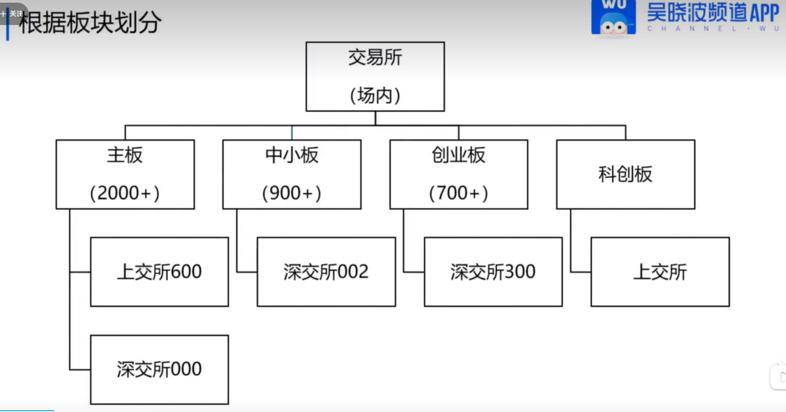

#### 行业划分

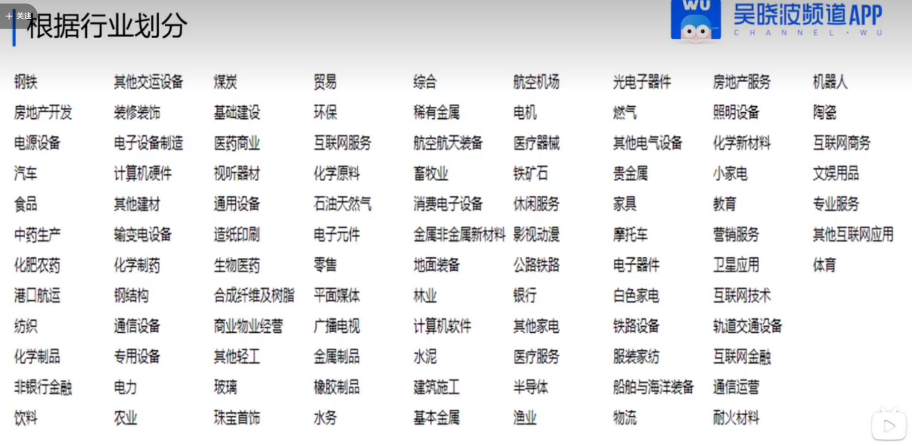

#### 概念划分

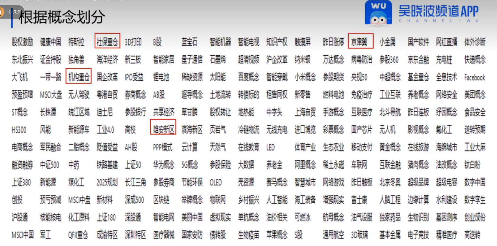

#### 公司类型划分

**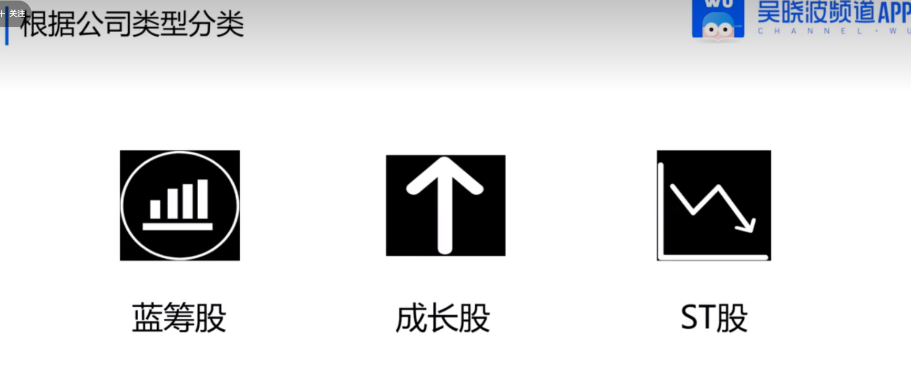**

### 股票指数

#### 指数的用途

- 判断市场状态
- 对比基准
- 投资

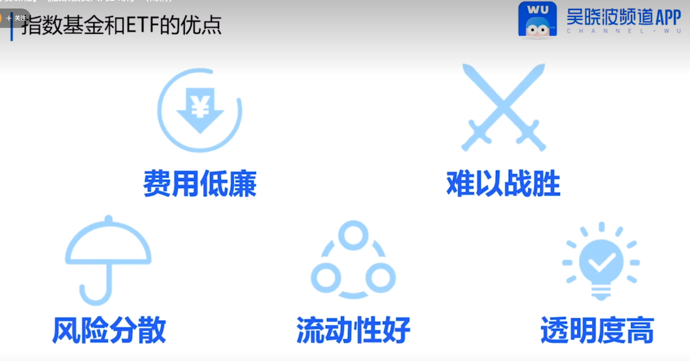

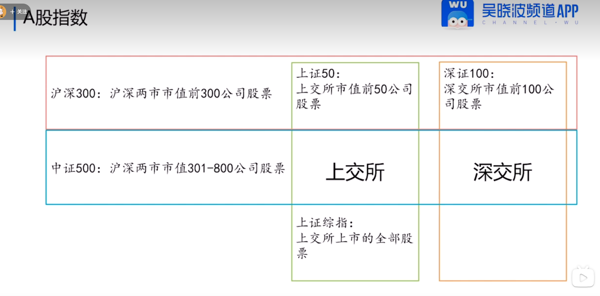

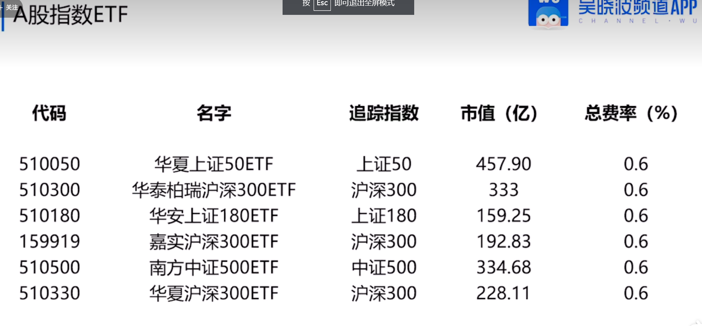

### A股特点

#### 散户多

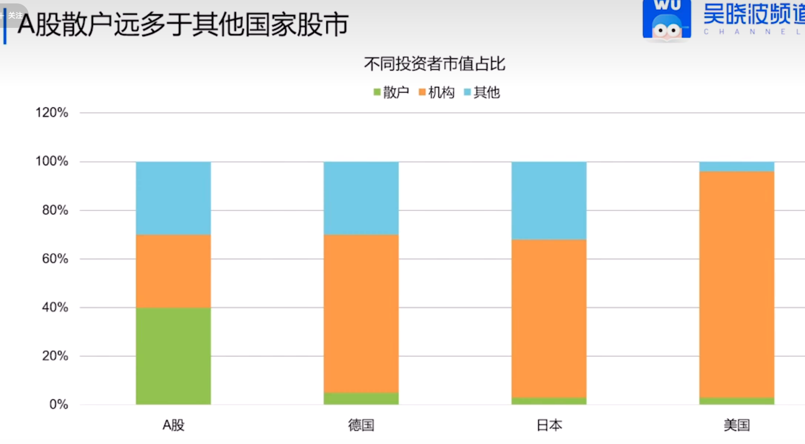

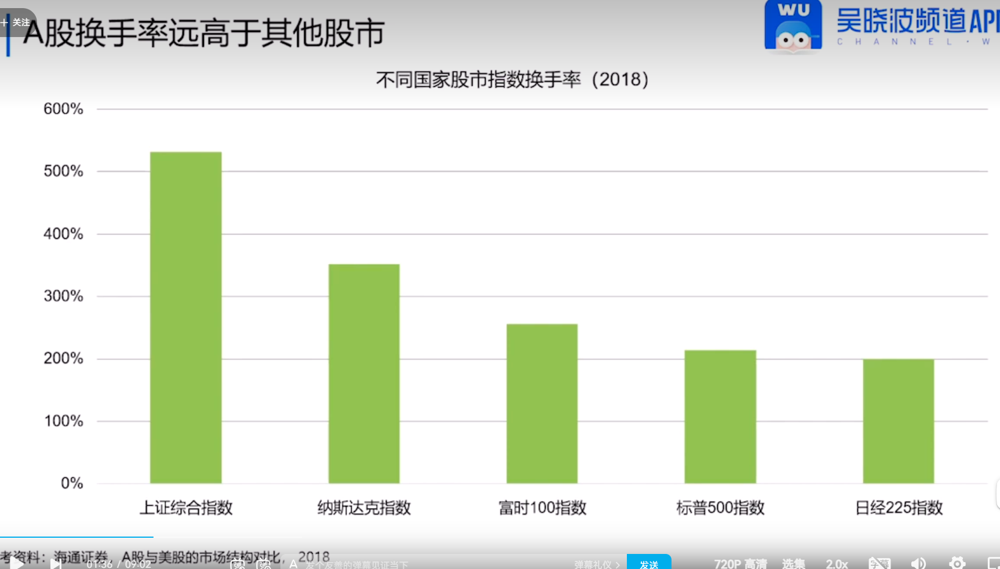

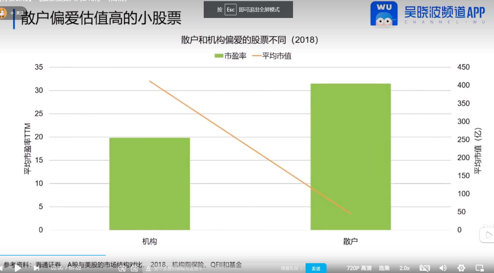

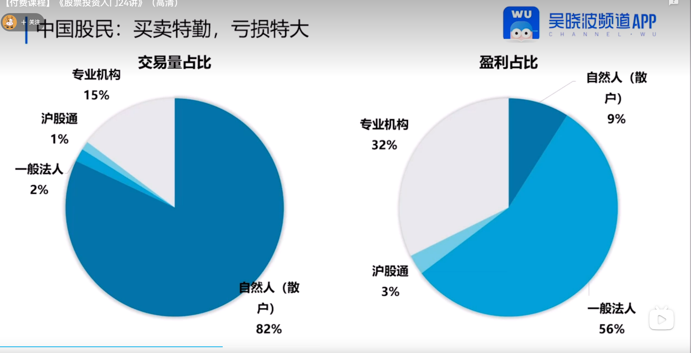

#### 周期股多

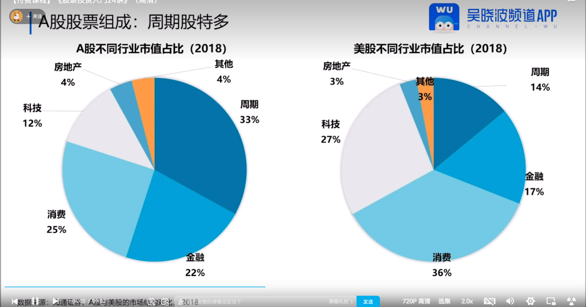

#### 波动大

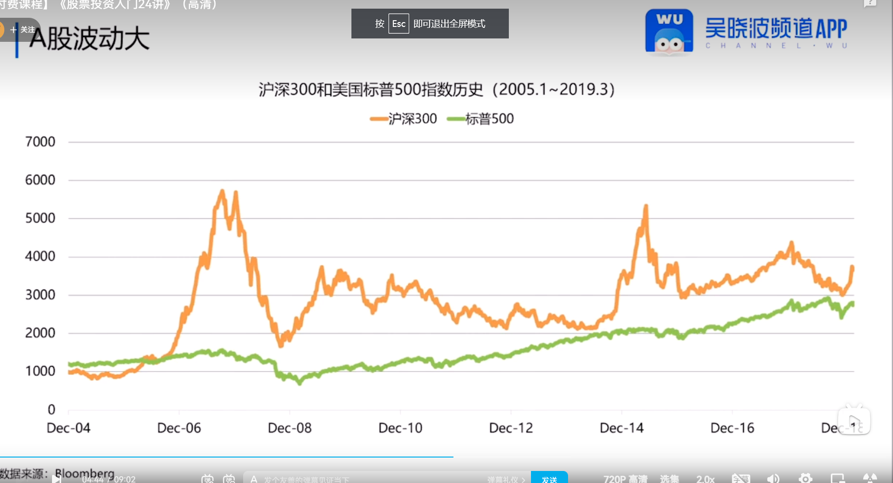

#### 圈钱多

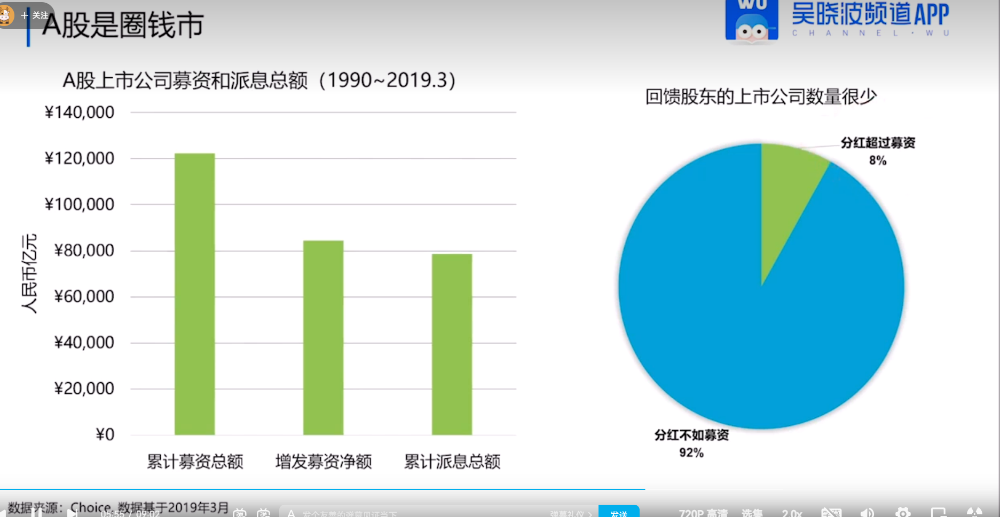

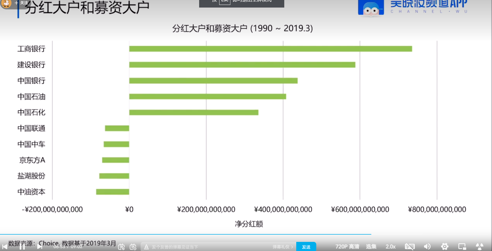

### 企业质量指标

#### 净资产收益率

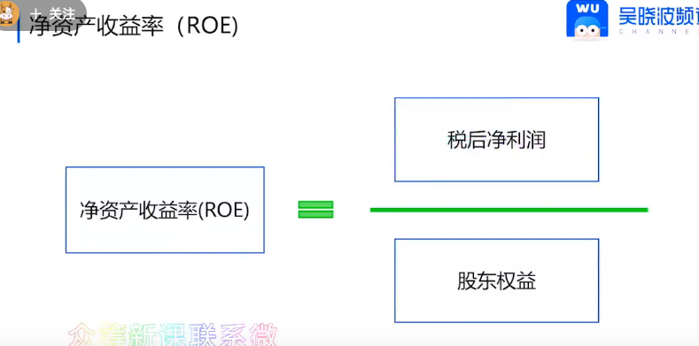

#### 总资产毛利率

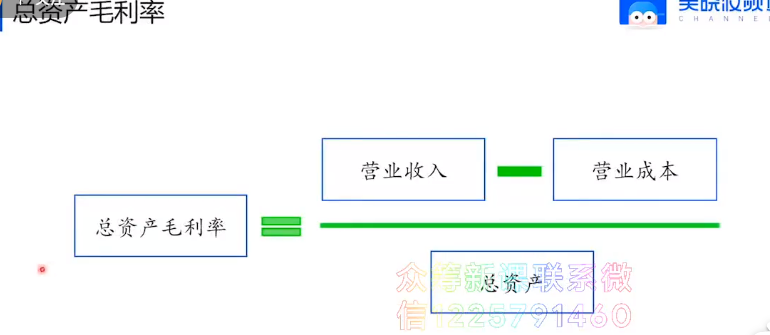

#### 分红率

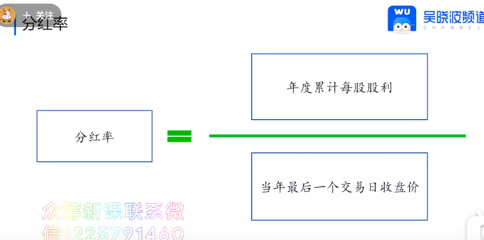

#### 经营活动现金流净额债务比

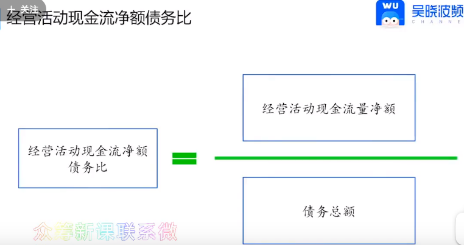

